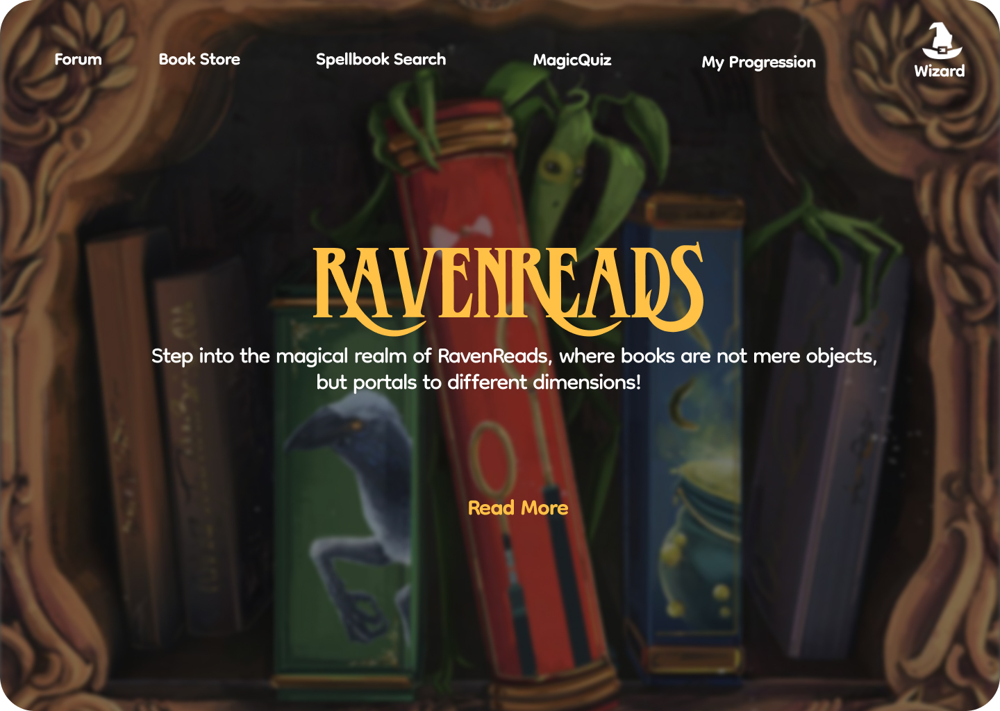
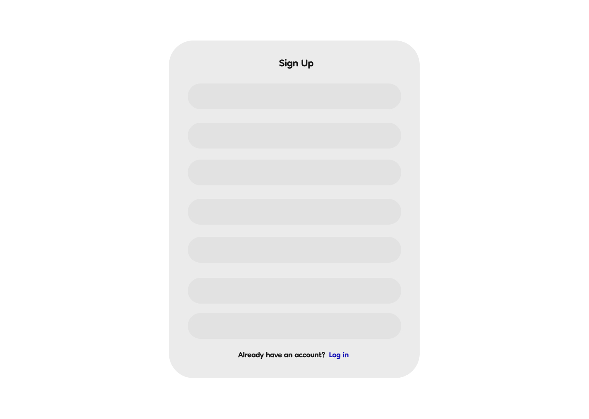
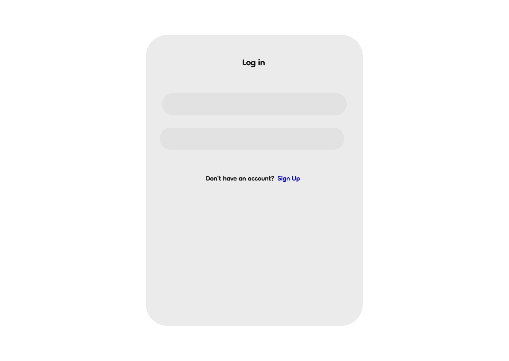
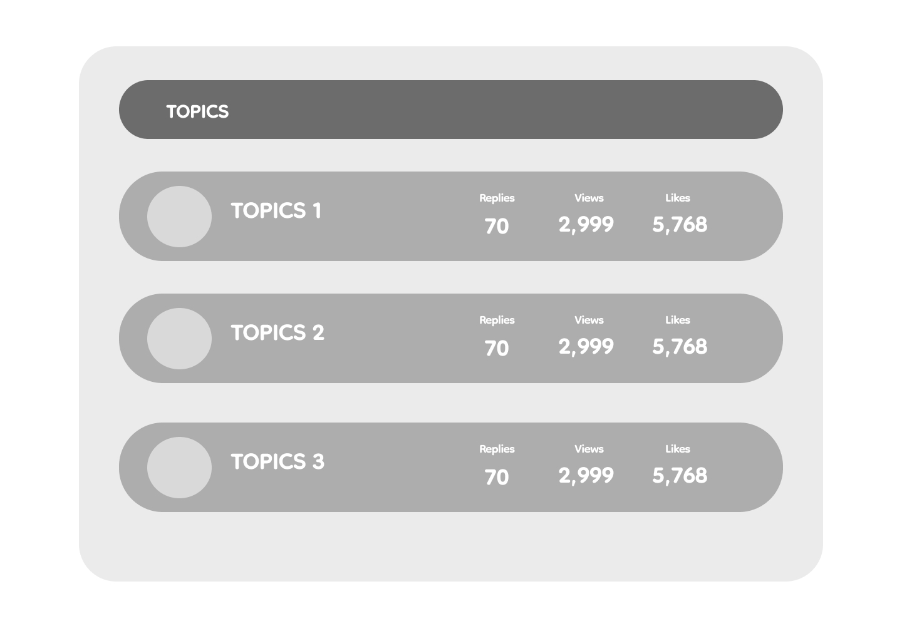
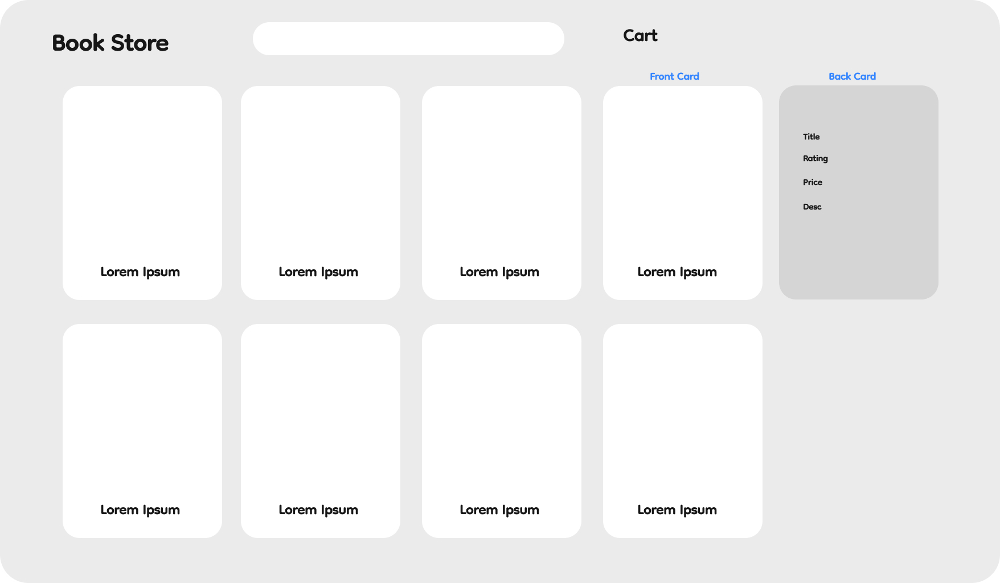
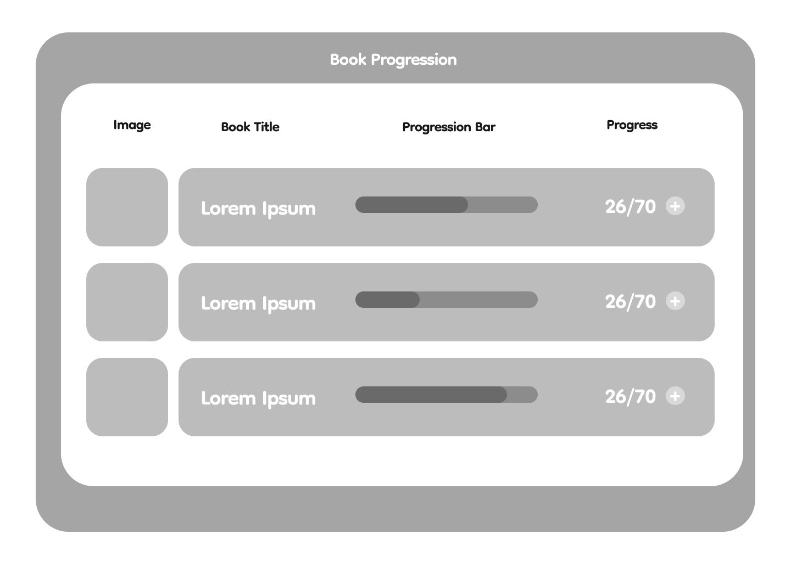
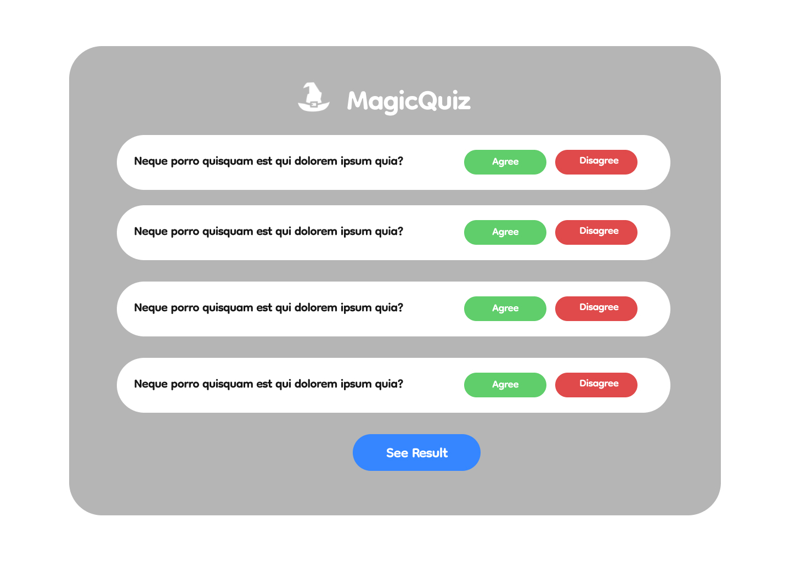

# RAVENREADS

 
Link GitHub : https://github.com/PBP-C2

 Anggota

- 2206082114 - Clement Samuel Marly 
- 2206031170 - Fikri Risyad Indratno 
- 2206082745 - Nandika Rafi Atallah 
- 2206030035 - Shafira Nurrohmah 
- 2206814425 - Rizki Maulana 

 Penjelasan Aplikasi 

`RavenReads` adalah *website* peminjaman buku yang menyediakan berbagai jenis buku untuk dibaca dan dipinjam pengguna. Setiap pengguna `RavenReads` harus memiliki akun untuk mengakses fitur-fitur dari `RavenReads`. Apabila pengguna belum memiliki akun, pengguna dapat mendaftar akun baru untuk menggunakan aplikasi `RavenReads`. `RavenReads` akan menyediakan banyak buku yang bisa dibaca oleh pengguna dan di-bookmark agar pengguna dapat menandai buku yang ingin dilanjutkan membaca. Buku yang di-*bookmark* juga akan memiliki *progression bar* yang menandakan progress membaca dari pengguna pada buku yang bersangkutan. Setiap buku akan memiliki sistem *review* dan rating untuk mengetahui buku yang populer dan buku yang memiliki kualitas tinggi.

Daftar Modul

## Main Page
| NO | MAIN PAGE                              | PENJELASAN |
|----|-----------------------------------|------------|
| 1  | **Homepage**                         | **Homepage** adalah halaman pertama yang dilihat pengunjung saat mereka mengunjungi situs. Halaman ini harus mencakup gambaran umum tentang situs dan apa yang ditawarkannya.   - **Fitur Pencarian Buku:** Fitur ini memungkinkan pengguna untuk mencari buku berdasarkan judul, penulis, genre, atau kata kunci lainnya. Untuk membuat fitur lebih menarik kita bisa menamakannya dengan "*Spellbook Search*".   - **Katalog Buku**  Bagian ini mencakup daftar semua buku yang tersedia untuk dipinjam. Setiap buku harus memiliki deskripsi singkat, penulis, dan informasi lain yang relevan. Kita dapat mengatur buku-buku ini berdasarkan genre, penulis, atau popularitas.  - **Rekomendasi Buku:** Pengguna dapat mengetahui rekomendasi buku dari websites sesuai dengan kesukaan mereka terhadap buku-buku yang sering mereka baca.   - **Bertema Harry Potter:** Seluruh situs harus dirancang dengan tema Harry Potter. Ini bisa mencakup warna, font, gambar, dan elemen desain lainnya. Kami juga menggunakan simbol-simbol ikonik dari seri buku, seperti tongkat sihir, dan topi penyihir. |
 

## Modul
| NO | MODUL                              | PENJELASAN |
|----|-----------------------------------|------------|
| 1  | **Discussion Forum**                        | Wadah interaktif bagi pengguna untuk berbagi dan berdiskusi tentang buku yang sedang mereka baca. Modul ini memungkinkan pengguna untuk saling bertukar cerita, ulasan, dan pemikiran tentang buku-buku yang mereka nikmati.  |
| 2  | **SpellBook & Whole Scroll**              | Modul website yang berjudul "SpellBook & Whole Scroll" adalah sebuah fitur interaktif di mana setiap pengguna dapat membuat dan membagikan "buku" mereka sendiri, yang dapat diakses dan dibaca oleh pengunjung website lain. Modul ini akan memberikan pengguna kesempatan untuk mengekspresikan ide-ide dan pengetahuan mereka dan berbagi dengan komunitas yang lebih besar.|
| 3  | **Book Reading Progression**           | Book Reading Progression akan berisi progres dari buku yang dibaca oleh pengguna. Book Reading Progression akan berisi fitur seperti:   - **Add Book**: Pengguna dapat menambahkan buku-buku yang sedang mereka baca dengan memasukkan id. Buku yang di-*add* akan dimasukkan ke dalam tabel untuk mencatat progres membaca buku pengguna.   - **Search**: Pengguna dapat memasukkan *string* ke dalam *search bar*, yang kemudian akan menampilkan buku yang memiliki *string* tersebut di dalam judulnya.   - **Progress**: Buku yang di-*add* akan memiliki progress yang berupa perbandingan antara halaman terakhir yang dibaca pengguna dan total halaman buku. Fitur progress dilengkapi dengan progress bar sehingga lebih mudah dilihat oleh pengguna.    - **Rating dan Review**: Setiap buku akan disediakan fitur *rating* dan *review* untuk mencatat penilain dan komentar pengguna terhadap suatu buku. |
| 4  | **MagicQuiz**                          | Modul MagicQuiz adalah tempat dimana pengguna bisa mengikuti serangkaian pertanyaan untuk mengetahui preferensi buku pengguna. Pada modul ini, pengguna akan diberikan beberapa pertanyaan yang akan menentukan rekomendasi buku yang akan diberikan modul saat pengguna selesai mengerjakan. Rekomendasi buku yang diberikan dibatasi menjadi hanya tiga buku berdasarkan hasil kuis dari pengguna. Apabila pengguna pernah mengerjakan kuis, akan muncul tombol yang memungkinkan pengguna untuk langsung melihat hasil rekomendasi dan pengguna tidak perlu mengerjakan kuis kembali.
| 5  | **Book Store**                         | Book Store akan berisi card-card berukuran persegi panjang berdiri yang memperlihatkan cover buku, judul buku, author, dan id buku. Pada bagian atas halaman, terdapat button Add Book to Checkout yang digunakan untuk memasukkan buku ke dalam checkout dan button Checkout Details di samping kanan untuk melihat produk buku yang ingin dibeli. 

Dataset 
 

[Book Recommendation Dataset](https://www.kaggle.com/datasets/jealousleopard/goodreadsbooks)   *Source*: www.kaggle.com

**Penjelasan dataset:**
- **bookID**: Nomor identifikasi unik untuk setiap buku.
- **title**: Nama di bawah mana buku tersebut diterbitkan.
- **authors**: Nama-nama penulis buku. Jika ada beberapa penulis, mereka dipisahkan dengan tanda -.
- **average_rating**: Rata-rata peringkat buku yang diterima secara keseluruhan.
- **isbn**: Nomor unik lainnya untuk mengidentifikasi buku, yaitu Nomor Standar Buku Internasional.
- **isbn13**: ISBN 13-digit untuk mengidentifikasi buku, alih-alih ISBN standar 11-digit.
- **language_code**: Membantu memahami bahasa utama buku. Misalnya, eng adalah standar untuk bahasa Inggris.
- **num_pages**: Jumlah halaman yang terdapat dalam buku.
- **ratings_count**: Jumlah total peringkat yang diterima buku.
- **text_reviews_count**: Jumlah total ulasan teks yang diterima buku.

Pengguna

| NO | PENGGUNA                             | PENJELASAN |
|----|-----------------------------------|------------|
| 1  | **Reguler / Muggles**             | Pengguna yang dapat membuat akun atau login ke aplikasi untuk mengakses berbagai fitur aplikasi, seperti mencari buku, membaca dan meminjam buku, menandai buku atau bookmark. Pengguna normal atau Muggles tidak bisa memberikan review atau rating pada buku.|
| 2 | **Premium / Wizard**  | Wizard atau pengguna premium memiliki kemampuan yang sama dengan pengguna normal dengan kemampuan tambahan, yaitu memberikan review atau rating pada tiap buku. Hal ini dilakukan agar review dan rating yang diberikan memiliki tingkat validitas yang tinggi dan dapat dipercaya pengguna lainnya |
| 3 | **Admin** | Pengguna dengan akses penuh yang memiliki peran khusus dalam mengelola dan mengawasi aplikasi. Admin dapat mengelola data, mengakses panel admin, mengatur peran pengguna, dan menjaga keamanan. Admin memiliki peran penting dalam memastikan kinerja dan keamanan aplikasi Django. |

Rough Design

- **Wireframe**
  

- **Sign Up Page**
  

- **Log In Page**
  

- **DiscussionsForum**
  

- **BookStore**
  

- **BookProgression**
  

- **MagicQuiz**

